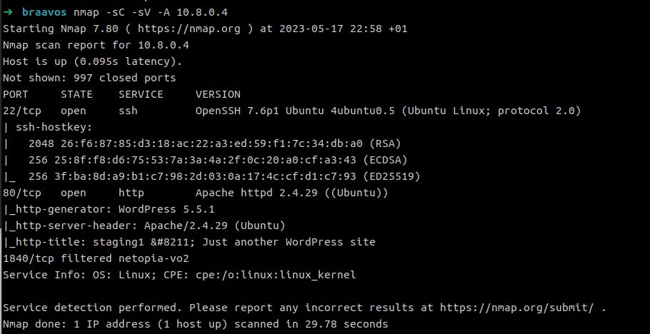
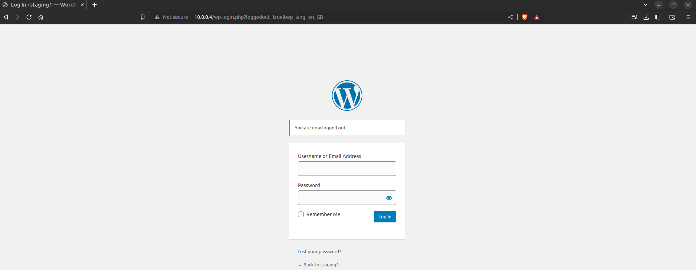
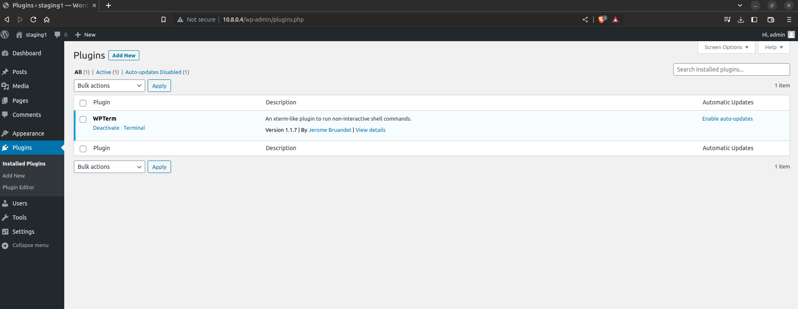
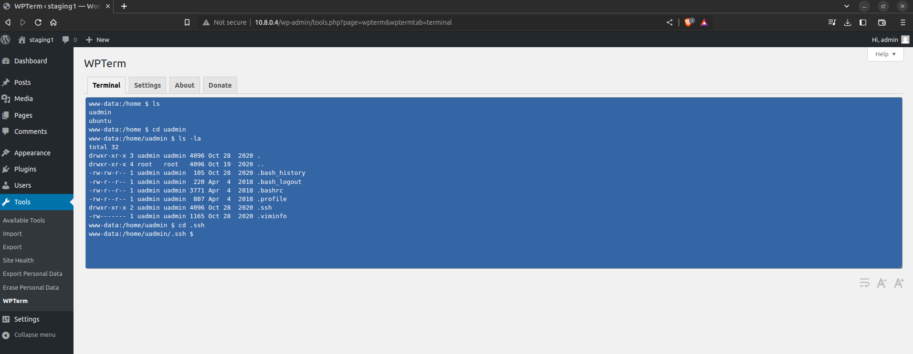
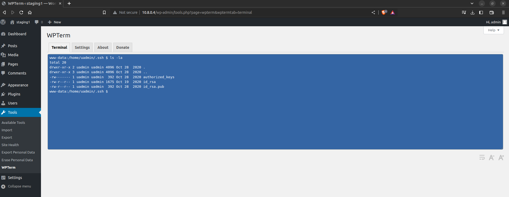
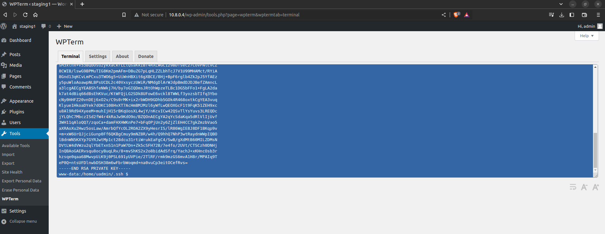
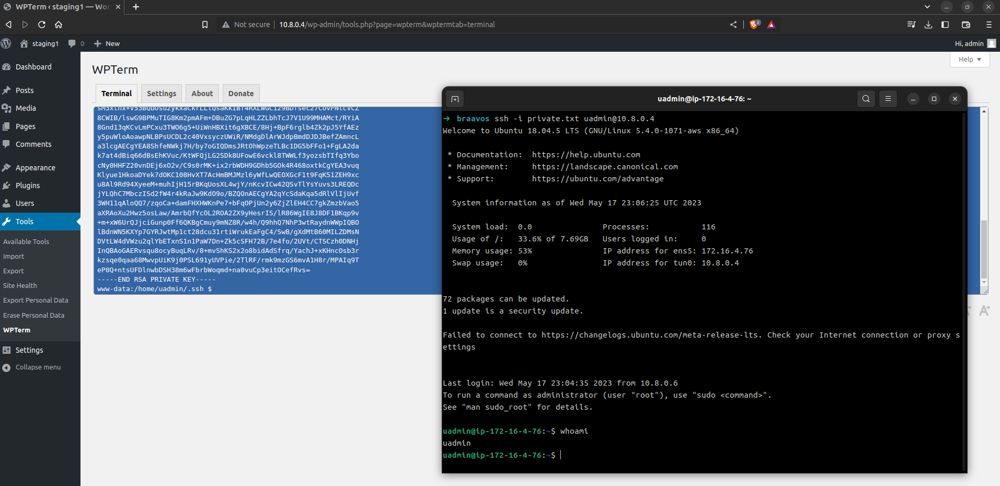

# Braavos

## Introduction

Braavos is a network of vulnerable Linux servers. Each box suffer from vulnerabilities that could grant you code execution on the system and get you the required flags. You will need to fully enumerate each target, search for attack vectors and bypass restrictions if needed.

## Writeup

# Enumeration

We run our usual nmap scan on the target machine 

``` nmap -sC -sV -A 10.8.0.4 ```



After a while looking for something to exploit based on the informations we got from our scan, it's time we give wordpress a try: 




logging in as admin:admin actually worked. And now we're in the admin control panel.



After browsing through the panel, we can see that there is a plugin installed.
WPTerm is a An xterm-like plugin to run non-interactive shell commands.
We can now run commands on the server.
Our goal is to have access to the server through an SSH vulnerability.

Let's connect first to the machine.

We can see that we have access to the ssh private key, which we can use to connect to the machine.




And now we're in 


### privilege escalation
Let's run our lovely <a href="https://github.com/carlospolop/PEASS-ng">linpeas</a>.
Since we don't have access to internet on the victim's machine, we can send it from our machine. 


