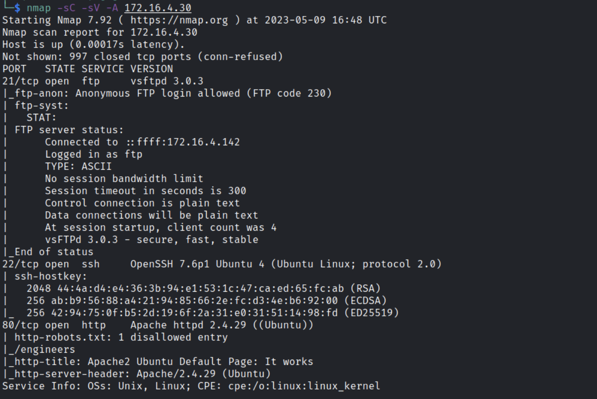
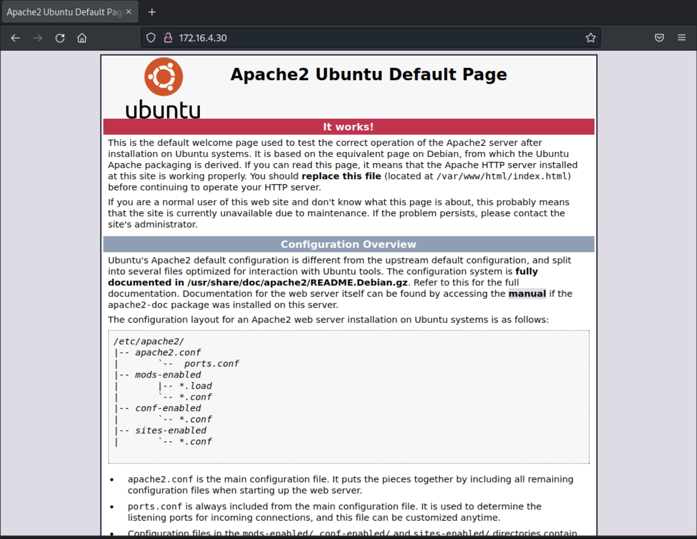
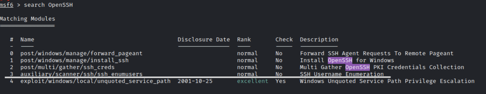
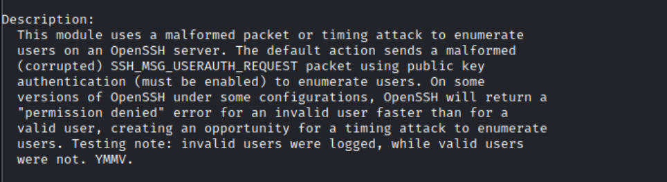
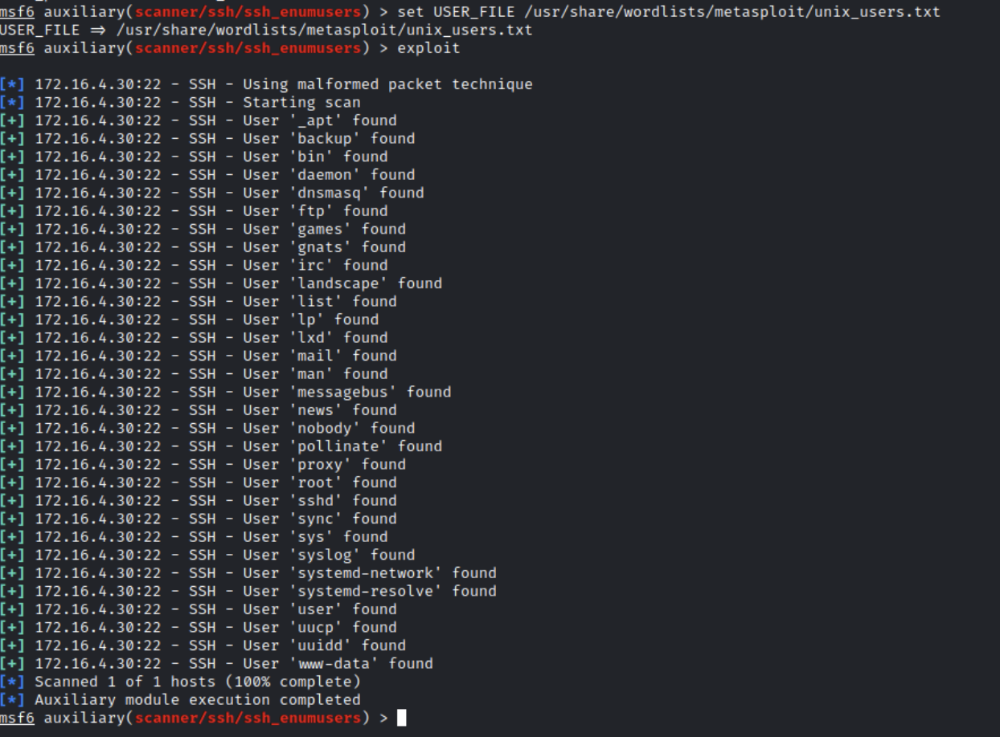
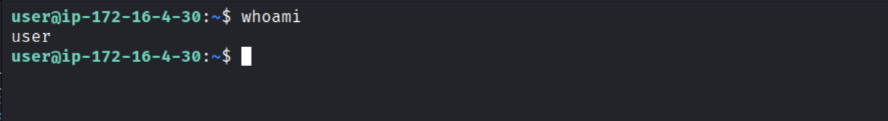
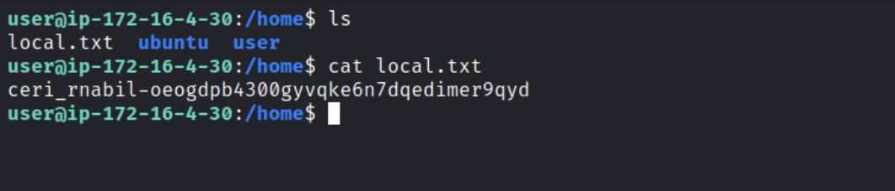
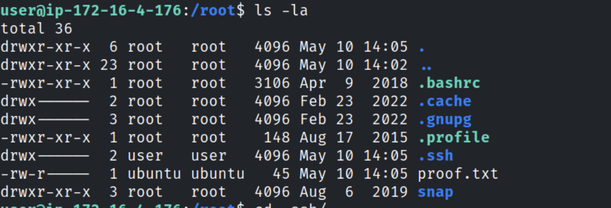
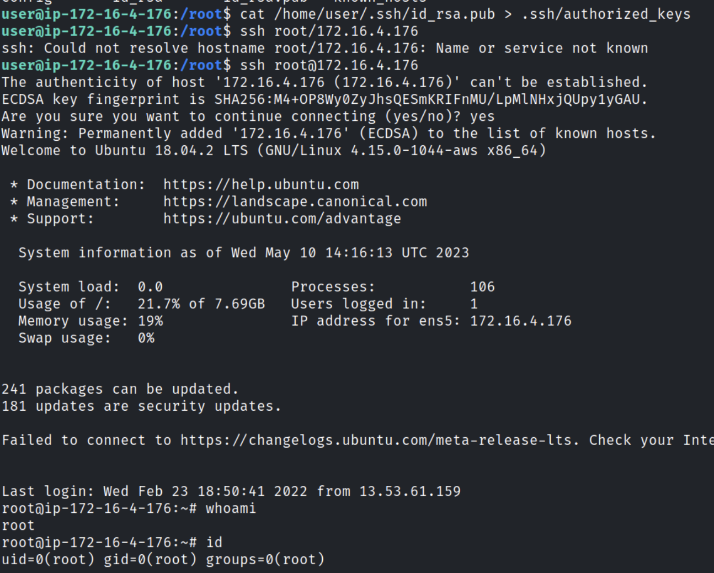

# SSH NINJA

## Introduction
The purpose of this lab is to reveal how SSH misconfigurations can be abused to gain access to a remote machine, elevate privileges, and perform pivoting. The lab is composed of 2 machines, on each machine, you have to gain unprivileged access first (1st Flag), then achieve root access (2nd Flag). The two machines are linked.

## Writeup

#### Enumeration

We start by running our nmap scan on the given ip address
````
Nmap -sC -sV <ip_address>
````


We can see that we have 3 open ports, and that it's hosting an http server 

We can also see that the robots.txt is disallowing entry to /engineers.
After a lot of digging, it seems like a rabbit hole. And since the lab is about SSH misconfigurations, and the given openssh version running on this server is so outdated, we can try different ways to exploit it.

#### Getting into the machine
Msf gave us few modules one of them look interesting.



Now it's time to use the exploit: 


Now that we've found our users, it's time to find the right one.
And we got access through the user with the username and password user/user. 

And we eventually got the first flag 


#### Privilege escalation
Now for the second part, we need to get access to root to read the proof.txt file where the second flag is.

We can see that we have enough privileges to write into the .ssh directory. And thus We'll generate an ssh key and add it to .ssh/authorized_keys and see if we can connect to root through it.


#### Getting into the second machine

Inside the known host file that we found in the user's .ssh directory, we could see there is another machine address


