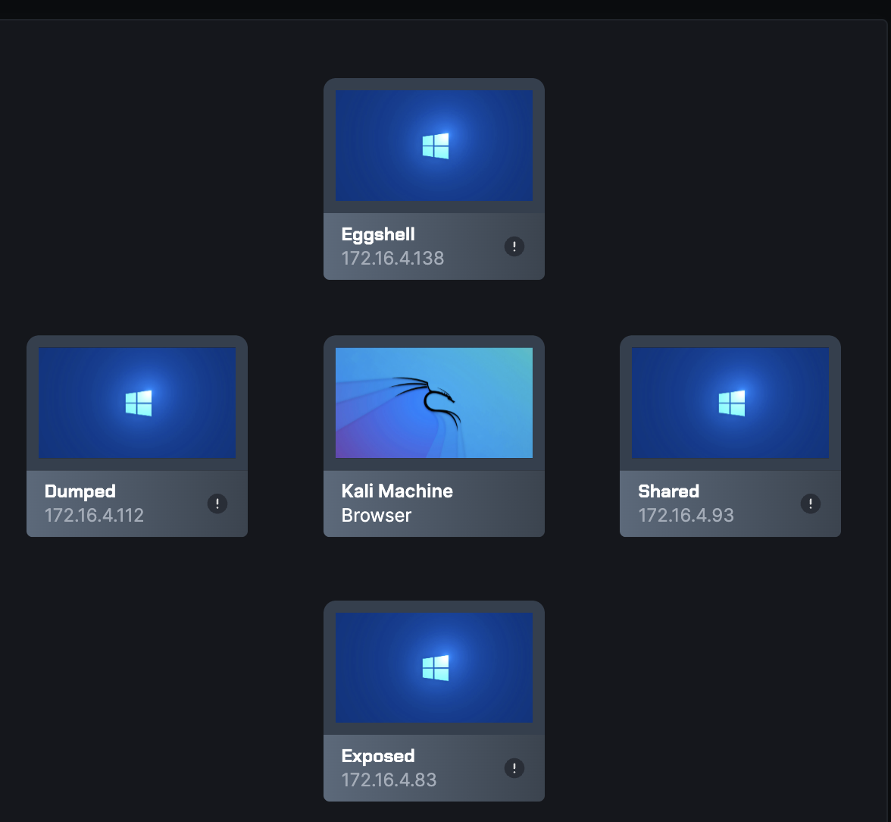
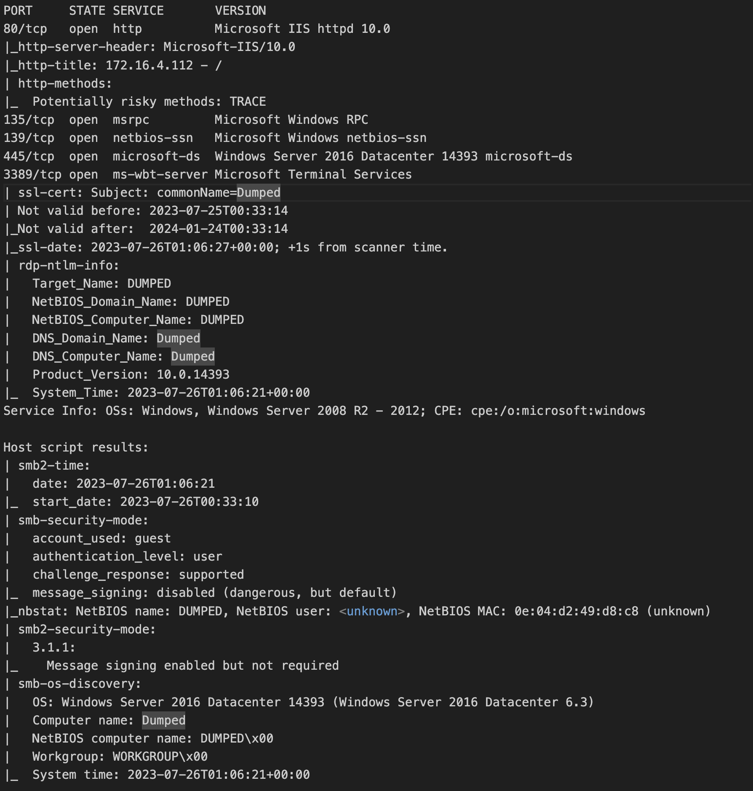

# Westeros 
### introduction
Westeros is a network of vulnerable Windows servers. Each box suffers from a severe vulnerability that if properly exploited, will grant you administrator access and get you the root flag located at the Administrator desktop folder.

## machine 1 : Dumped
### enumeration

### understanding the scan

We can see that there are 5 ports open:
<ol>
<li>
    Port 80 : We can see that there is a Windows IIS server on this port
</li>

<li>
    Port 135 : <a href="https://www.extrahop.com/resources/protocols/msrpc/">Msrpc</a> Microsoft Remote Procedure Call, also known as a function call or a subroutine call, is a protocol that uses the client-server model in order to allow one program to request service from a program on another computer without having to understand the details of that computer's network.
</li>
</ol>  

## machine 2 : Exposed

Starting Nmap 7.92 ( https://nmap.org ) at 2023-07-26 01:11 UTC
Nmap scan report for 172.16.4.83
Host is up (0.00049s latency).
Not shown: 990 filtered tcp ports (no-response)
PORT      STATE SERVICE            VERSION
80/tcp    open  http               HttpFileServer httpd 2.3
|_http-title: HFS /
|_http-server-header: HFS 2.3
135/tcp   open  msrpc              Microsoft Windows RPC
139/tcp   open  netbios-ssn        Microsoft Windows netbios-ssn
445/tcp   open  microsoft-ds       Microsoft Windows Server 2008 R2 - 2012 microsoft-ds
3389/tcp  open  ssl/ms-wbt-server?
| rdp-ntlm-info: 
|   Target_Name: WIN-NPIKVT9GRJD
|   NetBIOS_Domain_Name: WIN-NPIKVT9GRJD
|   NetBIOS_Computer_Name: WIN-NPIKVT9GRJD
|   DNS_Domain_Name: WIN-NPIKVT9GRJD
|   DNS_Computer_Name: WIN-NPIKVT9GRJD
|   Product_Version: 6.3.9600
|_  System_Time: 2023-07-26T01:12:18+00:00
|_ssl-date: 2023-07-26T01:12:58+00:00; 0s from scanner time.
| ssl-cert: Subject: commonName=WIN-NPIKVT9GRJD
| Not valid before: 2023-07-25T00:34:57
|_Not valid after:  2024-01-24T00:34:57
49152/tcp open  msrpc              Microsoft Windows RPC
49153/tcp open  msrpc              Microsoft Windows RPC
49154/tcp open  msrpc              Microsoft Windows RPC
49155/tcp open  msrpc              Microsoft Windows RPC
49156/tcp open  msrpc              Microsoft Windows RPC
Service Info: OSs: Windows, Windows Server 2008 R2 - 2012; CPE: cpe:/o:microsoft:windows

Host script results:
|_nbstat: NetBIOS name: WIN-NPIKVT9GRJD, NetBIOS user: <unknown>, NetBIOS MAC: 0e:6b:6c:0e:24:04 (unknown)
| smb-security-mode: 
|   account_used: <blank>
|   authentication_level: user
|   challenge_response: supported
|_  message_signing: disabled (dangerous, but default)
| smb2-security-mode: 
|   3.0.2: 
|_    Message signing enabled but not required
| smb2-time: 
|   date: 2023-07-26T01:12:18
|_  start_date: 2023-07-26T00:33:25

## machine 3 : Eggshell

nmap -sC -sV -oN nmap_initial_script 172.16.4.138
Starting Nmap 7.92 ( https://nmap.org ) at 2023-07-26 01:10 UTC
Note: Host seems down. If it is really up, but blocking our ping probes, try -Pn
Nmap done: 1 IP address (0 hosts up) scanned in 3.51 seconds
zsh: segmentation fault  nmap -sC -sV -oN nmap_initial_script 172.16.4.138

## machine 4 : Shared

Starting Nmap 7.92 ( https://nmap.org ) at 2023-07-26 01:10 UTC
Note: Host seems down. If it is really up, but blocking our ping probes, try -Pn
Nmap done: 1 IP address (0 hosts up) scanned in 3.60 seconds
zsh: segmentation fault  nmap -sC -sV -oN nmap_initial_script 172.16.4.93
