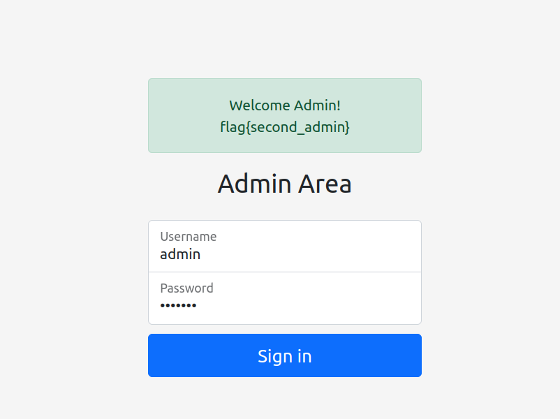

# Admin 2

### Description
This challenge is an introduction to injection and particularly <a href="https://portswigger.net/web-security/sql-injection"> sql injections</a>.
Usually SQL queries go like : 
```
Select column_name
From table_name
where Conditions
```
And when the input taken from the textboxes is unsanitized, the query turns into:
```
'Select column_name
From table_name
where Conditions ' OR '1'
```
where the second condition always returns True and thus returns all the data on that table or data source

### Solution
We can find all we need to know about SQL injections <a href="https://github.com/payloadbox/sql-injection-payload-list">here</a>. 
For this challenge we'll go with the simplest sql injection payload ```' OR '1```
<br>

