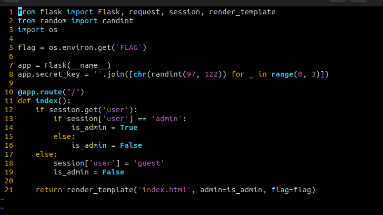
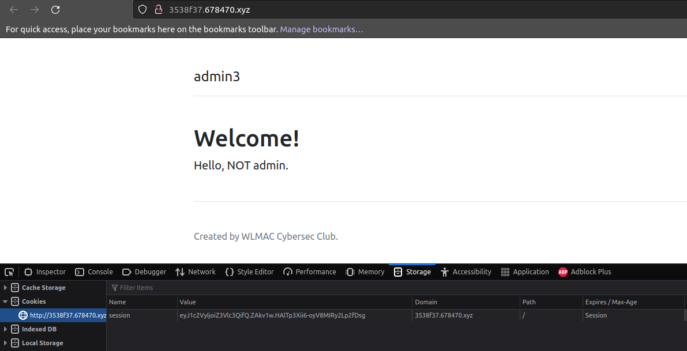
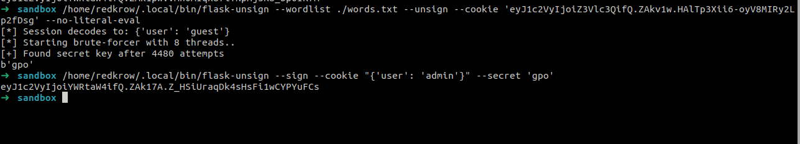
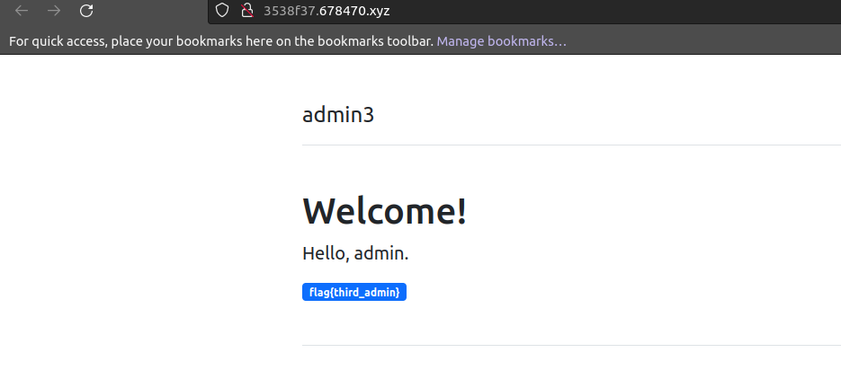

# Admin 3

### Description
This was my favorite challenge so far and my first challenge where I had to manipulate tokens to gain access as admin user.
They first provide us with a source code, which appears to be a python flask code.

After reading and understanding what the code does (the code checks if the user is equal to admin, if it is, the is_admin is turned into true and the flag is shown to us), and checking up the cookies for the webpage 

We can see that the page generates a cookie named session and a long encrypted value. 
before trying to solve this challenge, we can go through the <a href="https://pythonbasics.org/flask-sessions/">python flask description</a>. It appears that token we have translate to:
```
{
  "user": "guest"
}
```
But in order to alter it and turn guest into admin we need to figure out the value of app.secret_key (a random string made up with randomly generated 3 characters), and we can do so by bruteforcing the token to get the correct value of secret_key. 
The first step was to set up a word list made of all the possible combinations for the 3 characters string, and so I made this python script: 
```
import itertools

characters = list("abcdefghijklmnopqrstuvwxyz")

combinations = list(itertools.product(characters, repeat=3))

for combination in combinations:
    print("".join(combination))

```
And saved the output into a file wordslist.txt that we're going to use later.
Now for the big part, I used the technique described <a href="https://book.hacktricks.xyz/network-services-pentesting/pentesting-web/flask">here</a> to bruteforce the key and encode the payload. 

Now all we have to do is change the cookie value and refresh

