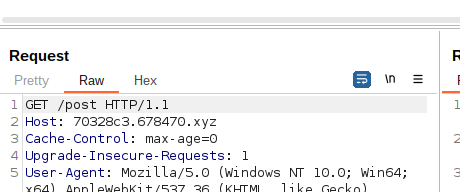
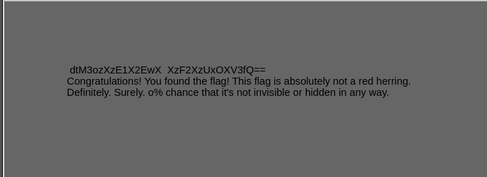
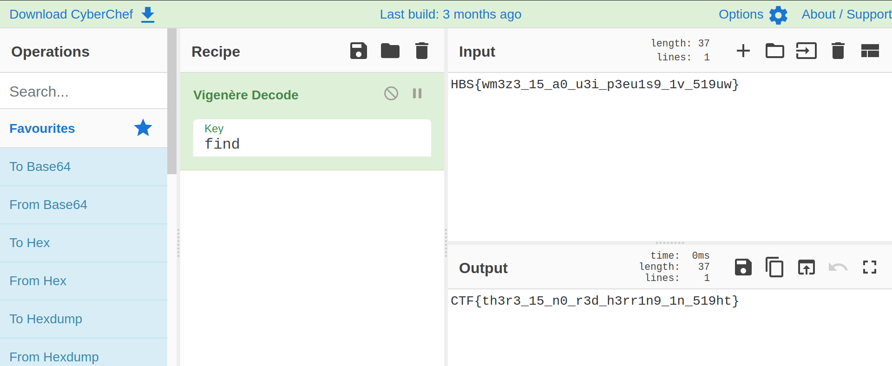

# Emoji search

### Description

After looking up each page individually. We found a clue in POST

now we have to inspect it further using Burpsuite

  We see that the request is being sent using the <a href="https://reqbin.com/Article/HttpGet#:~:text=GET%20is%20an%20HTTP%20method,on%20data%20on%20the%20server.">HTTP GET method </a>
We can try sending it using <a href="https://reqbin.com/Article/HttpPost"> HTTP POST method </a> with our Burpsuite repeater. 

We can see some hidden data in the source. 
the data given in the html in order: "SEJTe3 dtM3ozXzE1X2EwX 3UzaV9wM2V1MXM5 XzF2XzUxOXV3fQ==" and "Key: find"
 
At first sight it looked like a base64 encrypted message, and it was: "HBS{wm3z3_15_a0_u3i_p3eu1s9_1v_519uw}" but it was still encrypted. 
After a while looking for encrypting algorithms that use a key, the Vigenère algorithm could give us the solution. 
