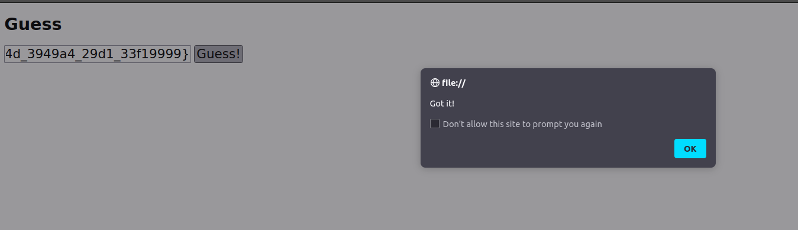

# Guess

### description
This challenge is a beginner friendly challenge about deobfuscation and reverse engineering of Javascript code.

After opening the html file included in the challenge. You can see some mess inside the script section.

After deobfuscating the code using this online <a href="https://deobfuscate.relative.im/">tool</a> and changing the values in VScode, it looks more readable now.

Now all we have to do is reverse it line by line.  
I left some comments on each condition inside the source code. 
