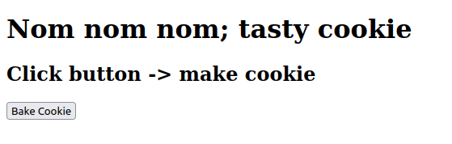
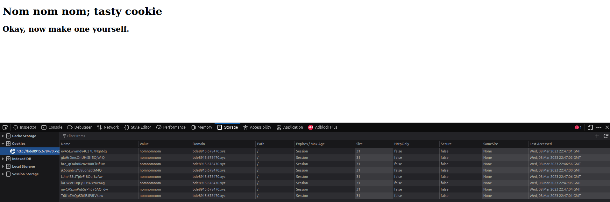
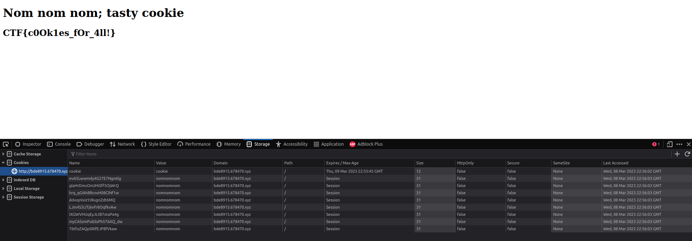

# Nom nom nom 

### Description 
This challenge is a newbie friendly introduction to <a href="https://en.wikipedia.org/wiki/HTTP_cookie"> HTTP cookies </a>

clicking the button keeps generating cookies on our browser 

### Solution
After generating several cookies, they ask us to make our own cookie. We can do so from our browser.
