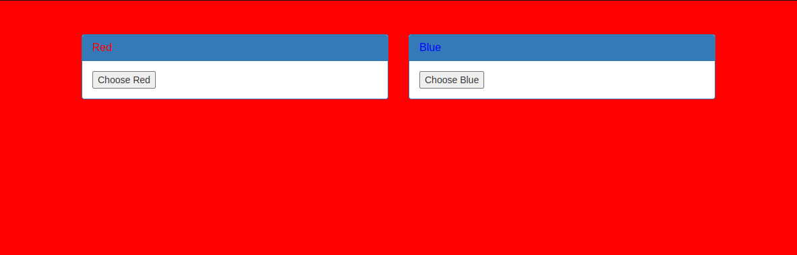
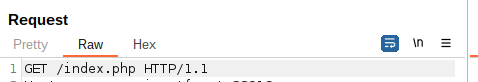
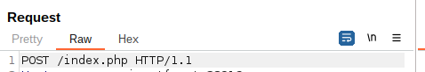

# get aHEAD

### Description
This challenge is about <a href="https://developer.mozilla.org/en-US/docs/Web/HTTP/Methods">http request methods</a>

 
First thing we see is this page, each of those buttons redirects us to a smilar page, one with a blue background and the other red.
After inspecting the requests using Burpsuite, We can see that one of the requests is being sent using GET and another using POST.

 
So the response we get is based on the type of the request we send.
After sending the reuqest to the repeater, and setting the request method to HEAD. I got the flag in the response.